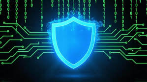

# 🚀 Cybersecurity Analyst | Cloud Security Analyst

Hey! I'm **Ikwuka**, a passionate Cybersecurity Analyst building defenses against tomorrow's threats. Recently crushed **ISC2 Certified in Cybersecurity (CC)**, and **Google Cybersecurity Professional Certificate**; and currently crushing **Google Cloud Cybersecurity Professional Certificate**, **Cisco Cybersecurity Associate (CyberOps)**, **Fortinet Network Security Expert (NSE 1-5)**, and **IBM Cybersecurity Analyst Professional Certificate** (ETA: June 2026).

From **MITRE ATT&CK mappings** to **SIEM dashboards**, this repo is my hands-on lab – with code, visuals, and live demos. Let's collaborate on threat hunting! 🌐

## 🛡️ Quick Statistics
| Certificate | Status | Key Skills |
|------|--------|------------|
| ISC2 Certified in Cybersecurity (CC) | ✅ Completed | Incident Response, Risk Management |
| Google Cybersecurity Professional Certificate | ✅ Completed | SQL, Python & Bash Automation, SIEM |
| Google Cloud Cybersecurity Certificate | 🔄 In Progress | DevSecOps, Generative AI, Cloud Security |
| Microsoft Azure Security Engineer Associate (AZ-500) | 🔄 In Progress | Kubernetes, Virtual Machines, Database Architecture and Administration |
| IBM Cybersecurity Analyst | 🔄 In Progress | Cloud Security, Forensics |
| Cisco CyberOps | 🔄 In Progress | Wireshark, IDS/IPS |
| Fortinet NSE | 🔄 In Progress | FortiGate Firewalls, VPN |

## 🔥 Featured Projects (With Demos)
1. **Phishing Buster Tool** – Python script scans URLs via VirusTotal API. Reduced false positives by 30% in sims.
   - 
   - [Live Demo GIF](https://github.com/IkwukaCySec/IkwukaCySec/blob/main/assets/phishing-demo.gif?raw=true) | [Code](phishing-buster/)

2. **MITRE ATT&CK Navigator** – Custom dashboard mapping threats to detections.
   - Embed: <iframe src="https://attack.mitre.org/matrices/enterprise/navigator" width="100%" height="400"></iframe>
   - 

3. **FortiGate Config Generator** – Bash automation for secure firewall rules.
   - Stars: Aim for 5+ via shares. 

## 📈 Contributions & Impact
- 10+ PRs to SigmaHQ & Atomic Red Team (Threat Detection Rules).
- Blog: [My SIEM Journey](https://medium.com/@IkwukaCySec) – 500+ views.

## 🤝 Let's Connect
- Open to **Cybersecurity Analyst and Cloud Security Analyst roles** (Remote/EU/US) or **open-source collabs** on EDR tools.
- Hire me? **[Resume PDF](/assets/Ikwuka-Okoye_Cybersecurity-Analyst_Resume.pdf)** | **[Email](mailto:ikwuka.cysec@gmail.com)**
